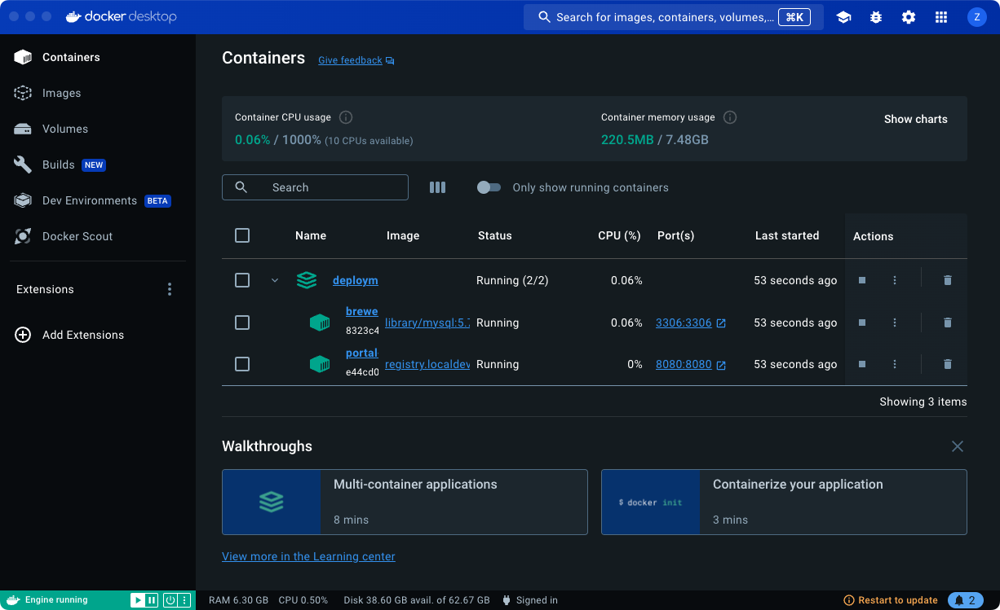

# C2E-BE-GO

用 Golang 语言主流的 Web 框架 Gin 重写 c2e-be， 故而工程以 c2e-be-go 命名。

📘 [Gin 文档传送门 ](https://gin-gonic.com/zh-cn/)

📘 [Gorm 文档传送门](https://gorm.io/docs/)

📘 [Geth 官方文档]([https://geth.ethereum.org/docs/]())

## 目录

```
├── api
│   ├── handler
│   │   └── xxx.go        # 用户相关的业务逻辑处理函数
│   ├── request
│   │   └── xxx.go        # 请求参数的定义和验证
│   ├── response
│       └── xxx.go        # 响应数据的定义
├── config
│   └── config.go          # 配置文件的加载、管理
├── database
│   └── database.go        # 数据库的初始化和连接管理
├── docs                   # 项目文档或接口文档
├── middleware
│   └── auth.go            # 中间件，如认证、日志等
├── model
│   └── xxx.go            # GORM 模型定义
├── repository
│   └── xxx_repository.go # 数据库访问逻辑，封装数据库操作
├── route
│   └── router.go          # 路由定义
├── service
│   └── xxx_service.go    # 业务逻辑层，调用 repository 处理业务
├── utils
│   └──xxx_utils.go        # 各种工具类
├── main.go                # 主入口文件
├── go.mod                 # Go modules 管理文件
├── go.sum                 # Go modules 依赖文件
├── output.log             # 项目日志, 运行时会自动生成
├── README.md  
├── .env                   # 环境变量文件, 不用也可以去掉
└── .gitignore   
```

## 启动项目

```
go get //安装依赖
go run main.go //运行项目
go test ./.. //运行所有测试用例
```


## 部署项目

cd deployment

docker-compose up -d



